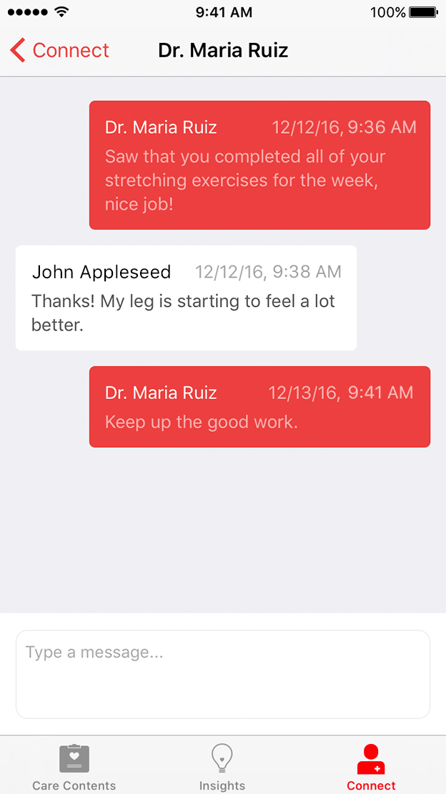

 
These materials are for informational purposes only and do not constitute legal advice. You should contact an attorney to obtain advice with respect to the development of a CareKit app and any applicable laws.

# Connecting with Care Teams and Personal Contacts
Protecting medical information is of utmost importance to your users. With CareKit, you can empower users to create connections that let them share their information with people that they trust. Users can connect with their care team (doctors and therapists, for example), and their personal contacts, such as close family and friends with whom the user feels comfortable sharing their information.

**On This Page:**
<ul>
<li> <a href="#create">Creating Contacts</a> </li>
<li><a href="#view">Presenting the Connect View Controller</a> </li>
<li><a href="#delegate">Implementing the Connect View Controller Delegate</a> </li>
<li><a href="#inbox">Creating Inbox for Messaging</a></li>
</ul> 

## Creating Contacts
Contacts are represented by the `OCKContact` class. Users can set and access information such as the contact name, relation to the user, phone number, email address, and photo.

### Care Team vs Personal Contacts
CareKit defines two types of contacts: Care team contacts and personal contacts. These two types are defined in the `OCKContactType` enumeration as `CareTeam` and `Personal`.

The following code demonstrates how to create a new care team contact:

      let newContact = OCKContact(contactType: .CareTeam,
                                                    name: "Bill James",
                                                    relation: "Nurse",
                                                    tintColor: Colors.Green.color,
                                                    phoneNumber: CNPhoneNumber(stringValue: "888-555-5512"),
                                                    messageNumber: CNPhoneNumber(stringValue: "888-555-5512"),
                                                    emailAddress: "billjames@example.com",
                                                    monogram: "BJ",
                                                    image: nil)

## Presenting the Connect View Controller
The connect view controller can display both care team and personal contacts. When creating the view controller, you must pass an array of `OCKContact` contact objects, as shown:
    
         let viewController = OCKConnectViewController(contacts: sampleData.contacts)
         viewController.delegate = self
         
    // Setup the controller's title and tab bar item
         viewController.title = NSLocalizedString("Connect", comment: "")
         viewController.tabBarItem = UITabBarItem(title: viewController.title,
                                                                       image: UIImage(named:"connect"),  
                                                                       selectedImage: UIImage(named: "connect-filled"))
    

When the connect view controller is created and displayed, the following view appears:

<figcaption>Figure 1: The Connect View</figcaption>

Users tap a contact to view the detailed contact information. From the detailed view, users can call, text, or email the contact, as well as send reports. Emails can also include attachments such as photos or documents.

<figcaption>Figure 2: Contact Details View</figcaption>

## Implementing the Connect View Controller Delegate
The connect view controller requires one delegate method that is called when a user taps Share for a given contact.
    
     func connectViewController(connectViewController: OCKConnectViewController, didSelectShareButtonForContact contact: OCKContact)

The delegate method is called with a reference to the `OCKConnectViewController` and a reference to the `OCKContact` object representing the currently viewed contact.

One common operation is to generate a report or other data, then send it to one of the many sharing services available in the `UIActivityViewController` as this example code shows:
   
    let document = someObject.generateSomeDocument()
    let activityViewController = UIActivityViewController(activityItems: [document], applicationActivities: nil)     
    presentViewController(activityViewController, animated: true, completion: nil)
   

## Creating Inbox for Messaging

The Inbox view controller provides a user interface for displaying messages between the user and care teams, family, and friends in a conversational format. You may choose to include this functionality in your app where asynchronous messaging might play a crucial role in a user's care journey.

<figcaption>Figure 3: Inbox Messages</figcaption>

### Setting Up Messaging
Use the `OCKConnectViewController` delegate and the `OCKConnectViewController` dataSource methods to set up the messaging user interface.
 
The code examples below show how to retrieve messages. As there could be multiple messages between the user and the care team, first determine how many messages are present:

    // return the number of messages for the selected contact
    func connectViewControllerNumber(ofConnectMessageItems viewController:
        OCKConnectViewController, careTeamContact: OCKContact) -> Int {
      // ...
    }

You can store `OCKConnectMessageItem`  message items in an array as you send and receive messages. Each message that is sent or received has a unique index number. 

    // return the message item for the selected inbox
    func connectViewController(_ viewController: OCKConnectViewController, connectMessageItemAt 
        index: Int, careTeamContact contact: OCKContact) -> OCKConnectMessageItem {
        // ...
    }

You can use the bridge API methods to create new conversations or append a new message to an existing conversation thread.

    // use the bridge API and cloud solution to send a secure message
    func connectViewController(_ viewController: OCKConnectViewController, didSendConnectMessage
        message: String, careTeamContact: OCKContact) {
        // ...
    }

To create and send messages, use the bridge API with a back end solution that can send and receive the messages securely.

See also:  Bridge API.

### Using Notifications and Badges for Inbox
Consider using notifications and badges for your CareKit app to indicate unread messages in the inbox.
For more information, see [Local and Remote Notification Programming Guide](https://developer.apple.com/library/ios/documentation/NetworkingInternet/Conceptual/RemoteNotificationsPG/Chapters/Introduction.html#//apple_ref/doc/uid/TP40008194).
