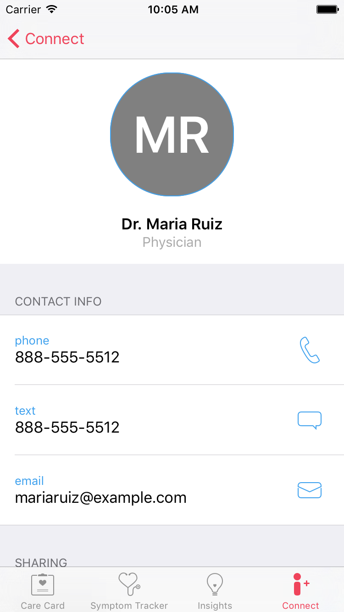

<br/>
<sub>These materials are for informational purposes only and do not constitute legal advice. You should contact an attorney to obtain advice with respect to the development of a CareKit app and any applicable laws.</sub>

# Connecting with Care Teams and Personal Contacts
Protecting medical information is of utmost importance to your users. With CareKit, you can empower users to create connections that let them share their information with people that they trust. Users can connect with their care team (doctors and therapists, for example), and their personal contacts, such as close family and friends with whom the user feels comfortable sharing their information.

## Creating Contacts
Contacts are represented by the `OCKContact` class. Information such as the contact name, relation to the user, phone number, email address, and photo are settable and accessible.

### Care Team vs Personal Contacts
CareKit defines two types of contacts: Care team contacts and personal contacts. These two types are defined in the `OCKContactType` enumeration as `CareTeam` and `Personal`.

The following code demonstrates how to create a new care team contact:

```swift
let newContact = OCKContact(contactType: .CareTeam,
    name: "Bill James",
    relation: "Nurse",
    tintColor: Colors.Green.color,
    phoneNumber: CNPhoneNumber(stringValue: "888-555-5512"),
    messageNumber: CNPhoneNumber(stringValue: "888-555-5512"),
    emailAddress: "billjames@example.com",
    monogram: "BJ",
    image: nil)
```

## Presenting the Contact View Controller
The contact view controller displays both care team and personal contacts. When creating the view controller, you must pass an array of `OCKContact` objects:

```swift
let viewController = OCKConnectViewController(contacts: sampleData.contacts)
viewController.delegate = self

// Setup the controller's title and tab bar item
viewController.title = NSLocalizedString("Connect", comment: "")
viewController.tabBarItem = UITabBarItem(title: viewController.title, image: UIImage(named:"connect"), selectedImage: UIImage(named: "connect-filled"))
```

Upon creation and display of the contact view controller, the following view appears:

<center>
<figcaption>Figure 1: The Contact View</figcaption></center>.

Users can tap on a contact to view the detailed contact information. From this view, the user tap on the appropriate icon to call, text, or email the contact, as well as send reports. Attachments such as photos or documents can be attached to the email as well.

<center>
<figcaption>Figure 2: The Details for a Contact</figcaption></center>.


## Implementing the Connect View Controller Delegate

When using the Connect View Controller, you must implement one required delegate.

```swift
func connectViewController(connectViewController: OCKConnectViewController, didSelectShareButtonForContact contact: OCKContact)
```

This delegate method is called when the user touches the Share button for a given contact. The delegate method is called with a reference to the `OCKConnectViewController` and a reference to the `OCKContact` object representing the currently viewed contact.

One common operation is to generate a report or other data, then send it to one of the many sharing services available in the `UIActivityViewController`:

```swift
let document = someObject.generateSomeDocument()
let activityViewController = UIActivityViewController(activityItems: [document], applicationActivities: nil)     
presentViewController(activityViewController, animated: true, completion: nil)
```
