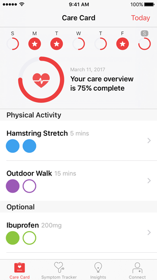
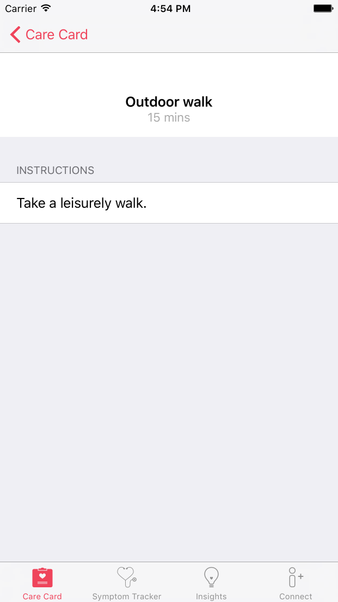

<br/>
<sub>These materials are for informational purposes only and do not constitute legal advice. You should contact an attorney to obtain advice with respect to the development of a CareKit app and any applicable laws.</sub>

# Creating the Care Card

The care card manages the tasks that the user must perform as part of their treatment plan. To create a care card, you must instantiate the app's care plan store and add the desired intervention activities to the store. Then, you simply instantiate and present the care card view controller.

<center>
<figcaption>Figure 1: The care card.</figcaption></center>.

CareKit automatically displays the intervention activity events for each day and automatically tracks the user's progress as they perform these tasks. The user can also tap on the activity to get more details or instructions.

<center><figcaption>Figure 2: Activity details.</figcaption></center>.


## Instantiate the Care Plan Store

Your app's care plan store is represented using the `OCKCarePlanStore` class. To instantiate a store object, you pass the constructor a URL for your store's data. This URL must point to a directory, and it indicates the location where the system loads and saves your store's files.


1. Generate a URL to a directory inside your app's documents directory.

	```swift
	let fileManager = NSFileManager.defaultManager()

	guard let documentDirectory = fileManager.URLsForDirectory(.DocumentDirectory, inDomains: .UserDomainMask).last else {
		fatalError("*** Error: Unable to get the document directory! ***")
	}

	let storeURL = documentDirectory.URLByAppendingPathComponent("MyCareKitStore")
	```

2. Verify that the directory exists. If it does not exists, create it.

	```swift
	if !fileManager.fileExistsAtPath(storeURL.path!) {
	   try! fileManager.createDirectoryAtURL(storeURL, withIntermediateDirectories: true, attributes: nil)
	}
	```

3. Instantiate the care plan store, and assign it to an instance variable for later use. You can also assign the store's delegate. This lets you respond to any changes to the store.

	```swift
	store = OCKCarePlanStore(persistenceDirectoryURL: storeURL)
	store.delegate = self
	```

You need only a single care plan store per app. The stores are long-lived objects. Create the store once, and keep a reference to it for later use.

When you instantiate a care plan store, it automatically loads any existing activities and automatically saves any changes you make to its activities. It also saves the user's progress on its events.

For more information on working with the care plan store, see [Accessing Care Plan Data](../AccessingCarePlanData/AccessingCarePlanData.html)

For more information on working with URLs and the iOS file system, see [File System Programming Guide](https://developer.apple.com/library/ios/documentation/FileManagement/Conceptual/FileSystemProgrammingGuide/Introduction/Introduction.html).

## Add Intervention Activities

1. Before adding an activity to the care plan store, you should check to see if that activity already exists.

	```swift
	store.activityForIdentifier(MyMedicationIdentifier) { (success, activityOrNil, errorOrNil) -> Void in
	    guard success else {
	        // perform real error handling here.
	        fatalError("*** An error occurred \(errorOrNil?.localizedDescription) ***")
	    }

	    if let activity = activityOrNil {

	        // the activity already exists.

	    } else {

	        // ADD THE ACTIVITY HERE...

	    }
	}
	```
	Each activity has a unique identifier. If an identifier is already used in the store, any attempt to add another activity with the same identifier has no effect on the store.

2. Create the activity's schedule.

	```swift
	// take medication twice a day, every day starting March 15, 2016
	let startDay = NSDateComponents(year: 2016, month: 3, day: 15)
	let twiceADay = OCKCareSchedule.dailyScheduleWithStartDate(startDay, occurrencesPerDay: 2)
	```

3. Instantiate the intervention activity.

	```swift
	let medication = OCKCarePlanActivity(
	    identifier: MyMedicationIdentifier,
	    groupIdentifier: nil,
	    type: .Intervention,
	    title: "Vicodin",
	    text: "5mg/500mg",
	    tintColor: nil,
	    instructions: "Take twice daily with food. May cause drowsiness. It is not recommended to drive with this medication. For any severe side effects, please contact your physician.",
	    imageURL: nil,
	    schedule: twiceADay,
	    resultResettable: true,
	    userInfo: nil)
	```
	Activity objects are immutable, which means that you cannot change their properties after they are created.

	To appear on the care card, the activity must use the `OCKCarePlanActivityType.Intervention` activity type. Intervention activities also require valid `schedule`, `title`, `text`, and `detailedText` parameters. The schedule sets the number of circles to be filled on each day. CareKit displays the title and text on the care card. It displays the detail text on the activity's detail scene. Other parameters are optional, and can further modify how the activity behaves, or how it appears.

	**Note:** the `resultsResettable` only applies to assessment activities. It has no effect in this example.

4. Add the activity to the store

	```swift
	store.addActivity(medication, completion: { (bool, error) in
      // your completion block  
	})
	```
The activity will appear in the Care Card.

## Create and Present the Care Card View Controller

To initialize your care card view controller, pass your care plan store to the constructor.

```swift
let careCardViewController = OCKCareCardViewController(carePlanStore: store)
```

You can now present the care card by pushing it onto a navigation controller.

```swift
// presenting the view controller modally
self.navigationController?.pushViewController(careCardViewController, animated: true)
```

For more information on working with view controllers, see [View Controller Programming Guide for iOS](https://developer.apple.com/library/ios/featuredarticles/ViewControllerPGforiPhoneOS/).


## Updating the Care Card

CareKit automatically updates the care card whenever you make changes to the care plan store. To modify the care card, simply add or remove intervention activities from the store.
