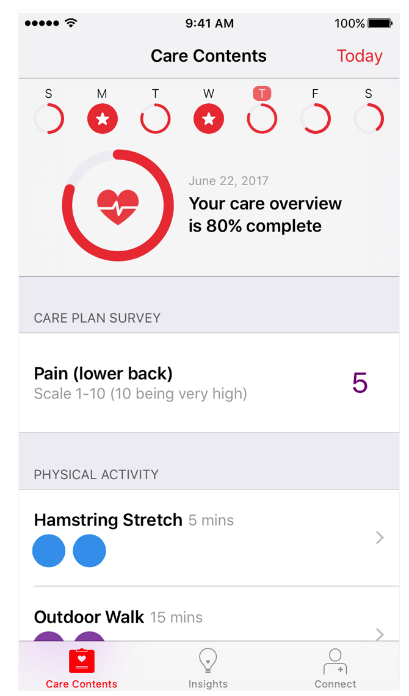
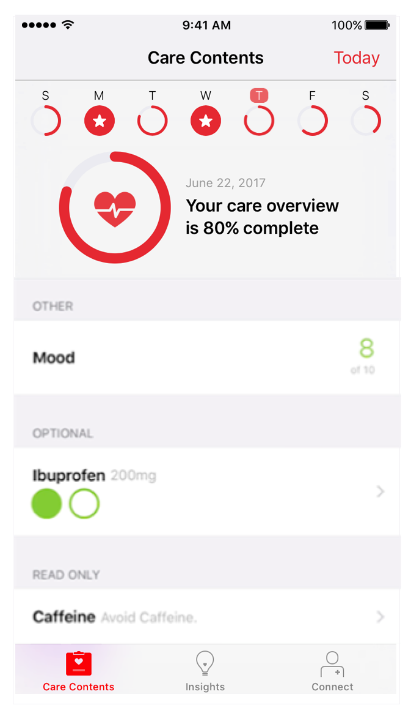

<br/>
<sub>These materials are for informational purposes only and do not constitute legal advice. You should contact an attorney to obtain advice with respect to the development of a CareKit app and any applicable laws.</sub>

# Creating a Care Plan

The CareKit framework enables your app to present users with an engaging and interactive way to track their treatment plans. The care plan activities you add to the care plan store appear automatically on the CareKit *scenes* you create.

**On This Page:**
<ul>
<li> <a href="#carecontents">Creating the Care Contents</a></li>
<li><a href="#carecard">Creating the Care Card</a></li>
<li><a href="#tracker">Creating the Symptom and Measurement Tracker</a></li> 
</ul> 

 The CareKit scenes that display care plan activities are:

* The *Care Contents* scene; provides a comprehensive view that can include all activity types, read-only activities, and optional activities.
* The *Care Card* scene; shows intervention activities.
* The *Symptom and Measurement Tracker*; shows assessment activities.

Typically, you use the Care Contents scene only. If your app must separate out interventions from assessments, you would use the Care Card and Symptom and Measurement Tracker scenes instead.

**Note:** All CareKit apps require a care plan store to persist the activities and data that make up the treatment plan. Before adding activities or other elements to a scene, you must create the care plan store as described in [Creating the Care Plan Store](../AccessingCarePlanData/AccessingCarePlanData.html#creating).


# Creating the Care Contents<a name="carecontents"></a>

The Care Contents view controller is a comprehensive view that can display all CareKit activities. On the Care Contents scene, users can see:

* compliance/progress for the week
* progress for the day with a customizable glyph
* all intervention activities
* all assessment activities 
* all optional activities
* read-only activities

<p style="float: left; font-size: 9pt; text-align: center; width: 25%; margin-left: 10%; margin-right: 15%; margin-bottom: 0.5em;">Figure 1: Care contents.</p>
<p style="float: left; font-size: 9pt; text-align: center; width: 25%; margin-right: 5%; margin-bottom: 0.5em;">Figure 2: Care contents with optional activity and read only activity.</p>
<p style="clear: both;">

The Care Contents scene is managed by an `OCKCareContentsViewController` view controller. Add the desired intervention and assessment activities, optional activities, and read-only activities to the app's care plan store (see [Creating the Care Plan Store](../AccessingCarePlanData/AccessingCarePlanData.html#creating)). Then, instantiate and present the care contents view controller.

## Customizing the Glyph
Apple's human interface team has designed 28 icons that you can use in your CareKit app. The glyphs display beautifully in your app and as a complication on the Apple Watch, where users can see their daily progress at a glance.
To see images of the glyphs and design guidance, see  [Human Interface Guidelines for CareKit](https://developer.apple.com/carekit/human-interface-guidelines/).

To use a glyph, set the glyph properties in the care contents view controller to display your desired icon.

    // Set the view controller glyph type and color
    let viewController = OCKCareContentsViewController(carePlanStore: store)
    
    viewController.glyphType = .heart
    viewController.glyphTintColor = .red

## Making Activities Optional
The care contents scene can display intervention and assessment activities that are optional for the user. A care plan can use optional interventions and assessments for activities the user may or may not need to do, such as taking pain medication.

You indicate that an activity is optional by setting its boolean property `optional` to true. Note that only the care contents scene supports optional activities. The code example shows creating an optional activity.

     // Setting an Activity as Optional
     let ibuprofenIntervention = 
              OCKCarePlanActivity.intervention(withIdentifier: "ibuprofen",
                                                                     groupIdentifier: "Pain Medication",
                                                                     title: "Ibuprofen",           
                                                                     text: "800 mg",
                                                                     tintColor: .green,
                                                                     instructions: "Take ibuprofen as needed for pain"   
                                                                     imageURL: nil,    
                                                                     schedule: schedule,
                                                                     userInfo: nil,
                                                                     optional: true)

## Adding Read-Only Activities
The care contents scene can display read-only activities. The code example shows creating a read-only activity.

    // Creating a read-only activity
     let recommendation = 
                  OCKCarePlanActivity.readOnly(withIdentifier: "readOnlyActivity",
                                                                       groupIdentifier: "Recommendations",
                                                                       title: "Avoid Alcohol",           
                                                                       text: "Until next appointment",   
                                                                       instructions: "Alcohol may increase chance of migraine"   
                                                                       imageURL: nil,    
                                                                       schedule: schedule,
                                                                       userInfo: nil)
                                                                         

# Creating the Care Card<a name="carecard"></a>

The care card manages the tasks that the user must perform as part of their treatment plan. To create a care card, you must first instantiate the app's care plan store and add the desired intervention activities to the store. Then, instantiate and present the care card view controller to display the care card.

<center>
<figcaption>Figure 3: The care card.</figcaption></center>.

CareKit automatically displays the intervention activity events for each day and automatically tracks the user's progress as they perform these tasks. The user can also tap on the activity to get more details or instructions.

<center><figcaption>Figure 4: Activity details.</figcaption></center>

##Adding Intervention Activities 
You can add intervention activities to the care plan that appear automatically on a Care Contents or Care Card scene. To appear on the Care Card, the activity must be an `OCKCarePlanActivityType.Intervention` activity type. 

Each activity has a unique identifier. If an identifier is already in use in the care plan store, attempting to add another activity with the same identifier has no effect on the store.

1. Before adding an activity to the care plan store, check if that activity already exists.
	
    	store.activityForIdentifier(MyMedicationIdentifier) { (success, activityOrNil, errorOrNil) -> Void in
    	    guard success else {
    	        // perform real error handling here.
    	        fatalError("*** An error occurred \(errorOrNil?.localizedDescription) ***")
    	    }
    
    	    if let activity = activityOrNil {
    
    	        // the activity already exists.
    
    	    } else {
    
    	        // ADD THE ACTIVITY HERE...
    	    }
    	}


2. Create the activity's schedule.
In this code example, `twiceADay ` is a schedule that includes a start data and sets the number of occurrences to 2. The schedule sets the number of circles to be filled in for each day.
    
    	// take medication twice a day, every day starting March 15, 2016
    	let startDay = NSDateComponents(year: 2016, month: 3, day: 15)
    	let twiceADay = OCKCareSchedule.dailyScheduleWithStartDate(startDay, occurrencesPerDay: 2)
    

3. Instantiate the intervention activity.

Intervention activities require valid `schedule`, `title`, `text`, and `detailedText` parameters.  CareKit displays the title and text on the care card. The detail text is displayed on the activity's detail scene. Other parameters are optional, and can further modify how the activity behaves, or how it appears. The `resultsResettable` only applies to assessment activities and has no effect in this example.

    	
    	let medication = OCKCarePlanActivity(
    	    identifier: MyMedicationIdentifier,
    	    groupIdentifier: nil,
    	    type: .Intervention,
    	    title: "Vicodin",
    	    text: "5mg/500mg",
    	    tintColor: nil,
    	    instructions: "Take twice daily with food. May cause drowsiness. It is not recommended to drive with this medication. For any severe side effects, please contact your physician.",
    	    imageURL: nil,
    	    schedule: twiceADay,
    	    resultResettable: true,
    	    userInfo: nil)
	
Activity objects are immutable, which means that you cannot change their properties after they are created.

4. Add the activity to the care plan store.
Activities appear automatically on the Care Contents or the Care Card when they are added to the care plan store.
	
    	store.addActivity(medication, completion: { (bool, error) in
          // your completion block  
    	})
	

## Creating and Presenting the Care Card View Controller

To initialize your care card view controller, pass your care plan store to the care card constructor.

    let careCardViewController = OCKCareCardViewController(carePlanStore: store)

Present the care card by pushing it onto a navigation controller.

    // presenting the view controller modally
    self.navigationController?.pushViewController(careCardViewController, animated: true)

For more information on working with view controllers, see [View Controller Programming Guide for iOS](https://developer.apple.com/library/ios/featuredarticles/ViewControllerPGforiPhoneOS/).


#Creating the Symptom and Measurement Tracker<a name="tracker"></a>

The Symptom and Measurement Tracker manages assessment actions and events to measure the effectiveness of the user's care plan.

The procedure for creating the Symptom and Measurement Tracker is similar to creating a Care Card, but involves an extra delegate object.

1. Add the desired assessment activities to the care plan store.
2. Create the Symptom and Measurement Tracker delegate.
3. Instantiate and present the Symptom and Measurement Tracker view controller.

The Symptom and Measurement Tracker automatically displays the assessment activity events for each day and automatically tracks the user's progress as they complete these events.

 <center>
<figcaption>Figure 5: Symptom Tracker Scene.</figcaption></center>.

## Adding Assessment Activities

Before adding an activity to the care plan store, you should check to see if that activity already exists. Each activity has a unique identifier. If an identifier is already in use in the care plan store, attempting to add another activity with the same identifier has no effect on the store.

1. Add an activity.

    	store.activityForIdentifier(MyEmotionalSurveyIdentifier) { (success, activityOrNil, errorOrNil) -> Void in
    	    guard success else {
    	        // perform real error handling here.
    	        fatalError("*** An error occurred \(errorOrNil?.localizedDescription) ***")
    	    }
    
    	    if let activity = activityOrNil {
    
    	        // the activity already exists.
    
    	    } else {
    
    	        // ADD THE ACTIVITY HERE... 
    	    }
    	}


2. Create the activity's schedule.
In this example, the activity is scheduled to occur once per day. The schedule sets the number of circles to be filled on each day.

    	// take the emotional survey once a day, every day starting March 15, 2016
    	let startDay = NSDateComponents(year: 2016, month: 3, day: 15)
    	let onceADay = OCKCareSchedule.dailyScheduleWithStartDate(startDay, occurrencesPerDay: 1)

3. Instantiate the assessment activity.

To appear on the Symptom and Measurement Tracker, the activity must be an `OCKCarePlanActivityType.Assessment` activity type. This activity type also appear on the Care Contents.

Assessment activities require valid `schedule`, `title`, and  `text` parameters. CareKit displays the title and text on the Symptom and Measurement Tracker. 

Other parameters can further modify how the activity behaves, or how it appears. In particular, the `resultResettable` parameter determines whether the user can retry the event after they have completed it. In this example, the user can take the survey only once each day, and they cannot edit their results.
	
    	let emotionalSurvey = OCKCarePlanActivity(
    	    identifier: MyEmotionalSurveyIdentifier,
    	    groupIdentifier: nil,
    	    type: .Assessment,
    	    title: "Daily Emotional Survey",
    	    text: "How are you feeling today?",
    	    tintColor: nil,
    	    instructions: nil,
    	    imageURL: nil,
    	    schedule: onceADay,
    	    resultResettable: false,
    	    userInfo: nil)

Activity objects are immutable, which means that you cannot change their properties after they are created.


<!--
## Creating the Symptom And Measurement Tracker Delegate

Before you can instantiate the Symptom And Measurement Tracker, you need to create a Symptom And Measurement Tracker delegate. One of your classes must adopt the `OCKEvaluationTableViewDelegate` protocol. This protocol declares a single, required method: the `tableViewDidSelectRowWithEvaluationEvent(evaluationEvent:)` method. The system calls this method whenever the user selects an activity in the Symptom And Measurement Tracker, passing in the current event for that activity.


    	func tableViewDidSelectRowWithEvaluationEvent(evaluationEvent: OCKCarePlanEvent) {
    		let identifier = evaluationEvent.activity.identifier
    		switch(identifier) {
    			case MyEmotionalSurveyIdentifier:
    				performSegueWithIdentifier("EmotionalSurveyScene", sender: self)
    
    			default:
    				fatalError("*** Unknown Identifier: \(identifier) ***")
    		}
    }


The example implementation starts by extracting the associated activity's identifier from the selected event. Next, it checks to see if the identifier matches any of the expected identifiers. If a match is found, it presents the event view controller for that match--in this case, the example code triggers the `EmotionalSurveyScene` segue from the app's storyboard.

If no match is found, a fatal error is thrown. This will only occur if you add a new assessment action, but forget to add a switch case for its identifier. This is an error you want to find and fix during development and testing.

### Recording the Result

The event view controller walks the user through the steps necessary to complete the event. When the user completes the event, the controller lets them save or cancel the event.

If the user cancels the event, you simply dismiss the event view controller. The action remains unchanged, and the user can select it again to restart the event.

If the user saves the event, you need to instantiate an event result object, and then update the event in the store.

```swift
let result = OCKCarePlanEventResult(valueString: happinessRating, unitString: nil, userInfo: nil)

store.updateEvent(event, withResult: result, state: .Completed) { (success, updatedEvent, error) -> Void in

    guard success else {
        fatalError(error!.localizedDescription)
    }

    print("Emotional Survey Event Updated")
}
```
The event result constructor takes three parameters. A string representing the value to be saved. An optional string representing the units for the value, and an optional dictionary containing any additional data you wish to include in the result.

> Is the dictionary limited to plist data types?

Next, use the `updateEvent(withResult:state:)` method to update the event with the result, and mark the event as completed. The Care Plan Store saves the event result, and updates the Symptom And Measurement Tracker.

### Event View Controllers for Passive Actions

If the app can passively collect the data for an assessment action (for example, it can successfully read the data from HealthKit), then you should simply record the result from HealthKit, marking the task as complete. The event view controller can simply show the currently stored value--though you might provide an option to let the user edit or manually take a new sample.

If the app cannot get the data passively (for example, there are no matching records in HealthKit), the event view controller should prompt the user to enter the value or manually take a sample using a hardware device. In other words, if the passive event fails, fall back to an active event.

> Is there anything else we need to say about presenting and processing assessment events?
-->

##Creating the Symptom and Measurement Tracker View Controller

To initialize your Symptom and Measurement Tracker view controller, pass your care plan store and your delegate to the constructor.
  
    let symptomTrackerController = OCKSymptomTrackerViewController(carePlanStore: store, delegate: self)

Next, present the Symptom and Measurement Tracker just like you would present any other view controller. You can add it to a tab bar controller, push it onto a navigation controller, or present it modally.
 
    // presenting the view controller modally
    presentViewController(symptomTrackerController, animated: true, completion: nil)
  
For more information on working with view controllers, see [View Controller Programming Guide for iOS](https://developer.apple.com/library/ios/featuredarticles/ViewControllerPGforiPhoneOS/).


## Updating the Care Contents, Care Card, or Symptoms and Measurement Tracker Scenes

CareKit automatically updates the Care Contents, Care Card, or Symptoms and Measurement Tracker scenes whenever you make changes to the care plan store. To modify scenes, add or remove intervention or assessment activities, or update assessment events in the care plan store.
