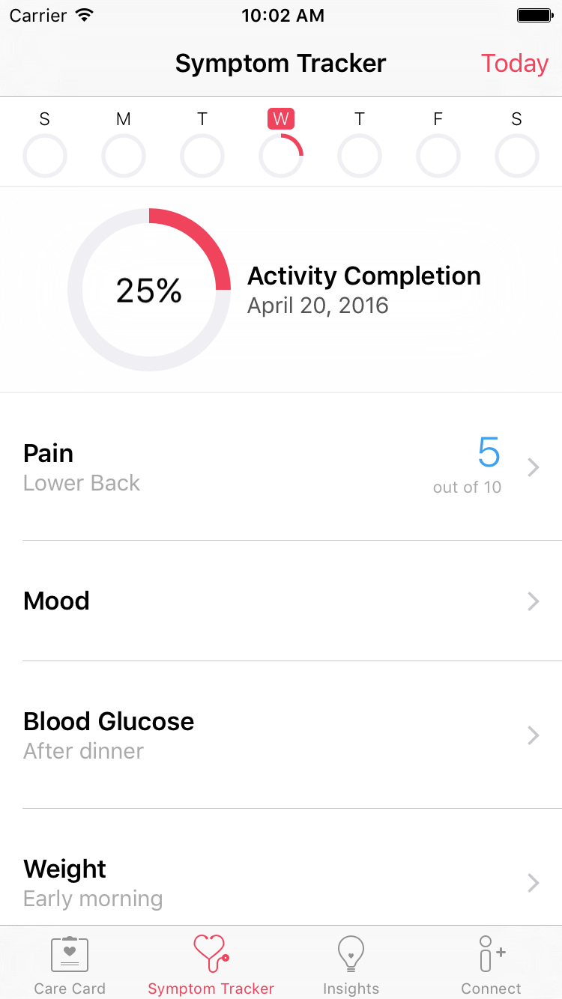
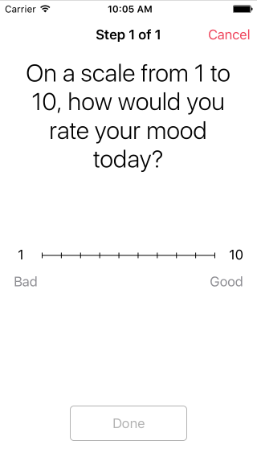

<br/>
<sub>These materials are for informational purposes only and do not constitute legal advice. You should contact an attorney to obtain advice with respect to the development of a CareKit app and any applicable laws.</sub>

# Creating the Symptom and Measurement Tracker

The Symptom and Measurement Tracker manages assessment actions and events to measure the effectiveness of the user's care plan.

 <center>
<figcaption>Figure 1: The Symptom and Measurement Tracker.</figcaption></center>.

The procedure for creating the Symptom and Measurement Tracker is similar to creating a Care Card, but involves an extra delegate object.

1. Instantiate the app's Care Plan Store.
2. Add the desired assessment activities to the store.
3. Create the Symptom and Measurement Tracker delegate.
4. Instantiate and present the Symptom and Measurement Tracker view controller.

The Symptom and Measurement Tracker automatically displays the assessment activity events for each day and automatically tracks the user's progress as they complete these events.

 <center>
<figcaption>Figure 2: An example evaluation.</figcaption></center>.

## Instantiate the Care Plan Store

If you haven't already instantiated the Care Plan Store, follow the instructions listed in [Creating the Care Card](../CreatingTheCareCard/CreatingTheCareCard.html).  


Remember: You need only a single care plan store per app. The stores are long-lived objects. Create the store once, and keep a reference to it for later use.

## Add Assessment Activities

1. Before adding an activity to the care plan store, you should check to see if that activity already exists.

	```swift
	store.activityForIdentifier(MyEmotionalSurveyIdentifier) { (success, activityOrNil, errorOrNil) -> Void in
	    guard success else {
	        // perform real error handling here.
	        fatalError("*** An error occurred \(errorOrNil?.localizedDescription) ***")
	    }

	    if let activity = activityOrNil {

	        // the activity already exists.

	    } else {

	        // ADD THE ACTIVITY HERE...

	    }
	}
	```
	Each activity has a unique identifier. If an identifier is already used in the store, any attempt to add another activity with the same identifier has no effect on the store.


2. Create the activity's schedule.

	```swift
	// take the emotional survey once a day, every day starting March 15, 2016
	let startDay = NSDateComponents(year: 2016, month: 3, day: 15)
	let onceADay = OCKCareSchedule.dailyScheduleWithStartDate(startDay, occurrencesPerDay: 1)
	```

3. Instantiate the assessment activity.

	```swift
	let emotionalSurvey = OCKCarePlanActivity(
	    identifier: MyEmotionalSurveyIdentifier,
	    groupIdentifier: nil,
	    type: .Assessment,
	    title: "Daily Emotional Survey",
	    text: "How are you feeling today?",
	    tintColor: nil,
	    instructions: nil,
	    imageURL: nil,
	    schedule: onceADay,
	    resultResettable: false,
	    userInfo: nil)
	```
	Activity objects are immutable, which means that you cannot change their properties after they are created.

	To appear on the Symptom and Measurement Tracker, the activity must use the `OCKCarePlanActivityType.Assessment` activity type. Assessment activities also require valid `schedule`, `title`, and  `text` parameters. The schedule sets the number of circles to be filled on each day. CareKit displays the title and text on the Symptom and Measurement Tracker.

	Other parameters can further modify how the activity behaves, or how it appears. In particular, the `resultResettable` parameter determines whether the user can retry the event after they have completed it. In this example, the user can take the survey only once each day, and they cannot edit their results.


<!--
## Creating the Symptom And Measurement Tracker Delegate

Before you can instantiate the Symptom And Measurement Tracker, you need to create a Symptom And Measurement Tracker delegate. One of your classes must adopt the `OCKEvaluationTableViewDelegate` protocol. This protocol declares a single, required method: the `tableViewDidSelectRowWithEvaluationEvent(evaluationEvent:)` method. The system calls this method whenever the user selects an activity in the Symptom And Measurement Tracker, passing in the current event for that activity.

```swift
	func tableViewDidSelectRowWithEvaluationEvent(evaluationEvent: OCKCarePlanEvent) {
		let identifier = evaluationEvent.activity.identifier
		switch(identifier) {
			case MyEmotionalSurveyIdentifier:
				performSegueWithIdentifier("EmotionalSurveyScene", sender: self)

			default:
				fatalError("*** Unknown Identifier: \(identifier) ***")
		}
}
```

	The example implementation starts by extracting the associated activity's identifier from the selected event. Next, it checks to see if the identifier matches any of the expected identifiers. If a match is found, it presents the event view controller for that match--in this case, the example code triggers the `EmotionalSurveyScene` segue from the app's storyboard.

If no match is found, a fatal error is thrown. This will only occur if you add a new assessment action, but forget to add a switch case for its identifier. This is an error you want to find and fix during development and testing.

### Recording the Result

The event view controller walks the user through the steps necessary to complete the event. When the user completes the event, the controller lets them save or cancel the event.

If the user cancels the event, you simply dismiss the event view controller. The action remains unchanged, and the user can select it again to restart the event.

If the user saves the event, you need to instantiate an event result object, and then update the event in the store.

```swift
let result = OCKCarePlanEventResult(valueString: happinessRating, unitString: nil, userInfo: nil)

store.updateEvent(event, withResult: result, state: .Completed) { (success, updatedEvent, error) -> Void in

    guard success else {
        fatalError(error!.localizedDescription)
    }

    print("Emotional Survey Event Updated")
}
```
The event result constructor takes three parameters. A string representing the value to be saved. An optional string representing the units for the value, and an optional dictionary containing any additional data you wish to include in the result.

> Is the dictionary limited to plist data types?

Next, use the `updateEvent(withResult:state:)` method to update the event with the result, and mark the event as completed. The Care Plan Store saves the event result, and updates the Symptom And Measurement Tracker.

### Event View Controllers for Passive Actions

If the app can passively collect the data for an assessment action (for example, it can successfully read the data from HealthKit), then you should simply record the result from HealthKit, marking the task as complete. The event view controller can simply show the currently stored value--though you might provide an option to let the user edit or manually take a new sample.

If the app cannot get the data passively (for example, there are no matching records in HealthKit), the event view controller should prompt the user to enter the value or manually take a sample using a hardware device. In other words, if the passive event fails, fall back to an active event.

> Is there anything else we need to say about presenting and processing assessment events?
-->

## Create the Symptom and Measurement Tracker View Controller

To initialize your Symptom and Measurement Tracker view controller, pass your Care Plan Store and your delegate to the constructor.

```swift
let symptomTrackerController = OCKSymptomTrackerViewController(carePlanStore: store, delegate: self)
```
Next, present the Symptom and Measurement Tracker just like you would present any other view controller. You can add it to a tab bar controller, push it onto a navigation controller, or present it modally.

```swift
// presenting the view controller modally
presentViewController(symptomTrackerController, animated: true, completion: nil)
```

For more information on working with view controllers, see [View Controller Programming Guide for iOS](https://developer.apple.com/library/ios/featuredarticles/ViewControllerPGforiPhoneOS/).

## Update the Symptom and Measurement Tracker

CareKit automatically updates the Symptom and Measurement Tracker whenever you make changes to the Care Plan Store. To modify the Symptom and Measurement Tracker, simply add or remove assessment activities from the store, or update assessment events in the store.
