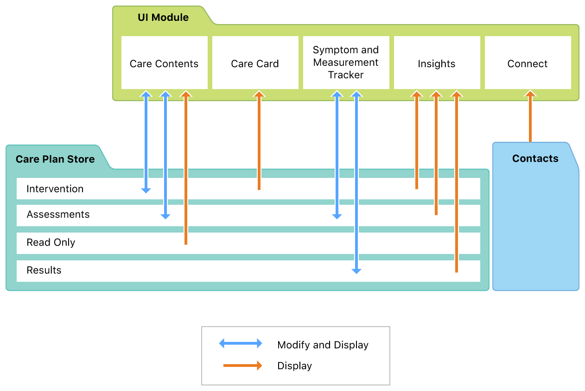
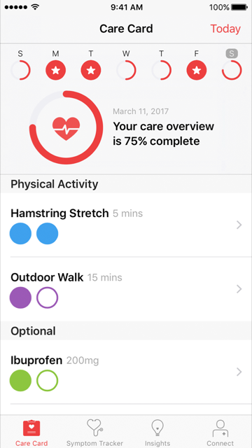
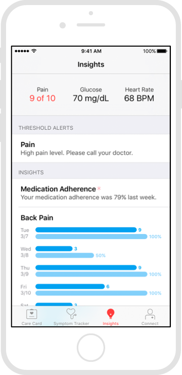
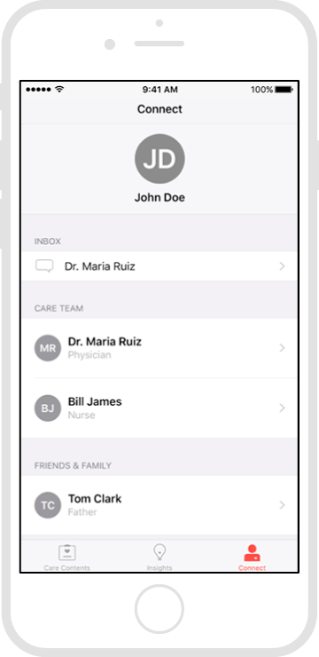

 
These materials are for informational purposes only and do not constitute legal advice. You should contact an attorney to obtain advice with respect to the development of a CareKit app and any applicable laws.

# CareKit Framework Programming Guide

CareKit is an open source framework for creating apps that place users at the center of their medical care. CareKit apps help users track treatment tasks on a daily basis, assess their progress, and communicate with caregivers, family, and friends. 

CareKit supports a wide range of care plans—from managing chronic illnesses, such as diabetes, to recovery from injury or surgery, to achieving health and wellness goals.

## Framework Organization

The CareKit framework is organized into six modules, with several additional data types. The most important interactions between the modules and data types are shown in *Figure 1*.

 
<figcaption>Figure 1: Relationship of items in the CareKit framework.</figcaption>

### Modules

**Care Card.** The scene managed by an `OCKCareCardViewController` object.  The Care Card presents and manages the tasks that the user is expected to perform as part of their treatment. For example, tasks might be taking a medication, changing a wound dressing, or meditating.

**Symptom and Measurement Tracker.** The scene managed by an `OCKSymptomTrackerViewController` object. The Symptom and Measurement Tracker presents and manages tasks that evaluate the effectiveness of the user's care plan. These include the subjective assessment of symptoms (such as pain scales) and objective measurements (such as blood pressure).

**Insights.** The scene managed by an `OCKInsightsViewController` object. The Insights scene displays charts that provide insight to the user by showing the relationship between treatment and progress. An insight can also include tips and alerts that help the user stay on track with their health goals. 

**Connect.** The scene managed by an `OCKConnectViewController` object. The Connect scene helps the user communicate their health status and Insights data with care team members, family, and friends.

**Care Plan Store.** The persistent database accessed through an `OCKCarePlanStore` object. This database stores the data displayed by the Care Card and Symptom and Measurement Tracker. CareKit automatically loads the store’s data as soon as the store is created, and it automatically saves any changes you make to the store. 

**Documents.** An `OCKDocument` object. This class creates custom reports that incorporate graphs and other information from the Insights module. Use `OCKDocument` to create PDF or HTML files that users can share with their contacts. A document can include a title, subtitles, text, images, and charts.

### Other Key Data Types:

**Intervention Activity.** An `OCKCarePlanActivity` object with a `OCKCarePlanActivityTypeIntervention` type. These activities represent the user’s care plan. They are stored in the Care Plan Store and displayed in the Care Card.

**Assessment Activity.** An `OCKCarePlanActivity` object with a `OCKCarePlanActivityTypeAssessment` type. These activities represent the plan for monitoring and evaluating the treatment's effectiveness. They are stored in the Care Plan Store and are displayed in the Symptom and Measurement Tracker.

**Intervention Event.** An `OCKCarePlanEvent` object associated with an intervention activity. These events represent the individual tasks that the user is expected to perform as part of their care plan. CareKit generates intervention events from active intervention activities. For example, if the activity indicates taking three doses of medication per day, CareKit generates three events for each day. 

**Assessment Event.** An `OCKCarePlanEvent` object associated with an assessment activity. These events represent the individual tasks that the user is expected to perform to monitor and evaluate the progress of their treatment. CareKit generates assessment events from active assessment activities. For example, if the activity indicates one pain survey per day, CareKit generates one event for each day. 

**Contact.** An `OCKContact` object. These contacts represent the user’s caregivers and supporters. CareKit displays contacts in the Connect module.

**Chart.** A concrete `OCKChart` subclass. Charts create a visual representation of the provided data. Charts can be both displayed in the Insights module and added to an `OCKDocument` object.

### Care Card

<figcaption>Figure 2: The Care Card scene.</figcaption>

The Care Card shows the user’s care plan for a particular day. The Care Card tracks the user's progress as they mark off intervention events.

The large heart shows the percentage of the day's events that the user has completed. The user's goal is to fill the entire heart by the end of the day.
 
Individual intervention activities are listed below the heart. The circles indicate the number of times that the user has to complete the task for the given day (that is, the number of events for the day). For example, if a user needs to take medication three times per day, there are three circles. When the user completes a particular task, such as taking one dose of medicine, they simply tap a circle. When tapped, the circle fills, indicating the completion of that task, and CareKit updates the corresponding event in the Care Plan Store.

The list of intervention activities can change from day to day. An exercise regime may be performed every other day, while medication is typically taken every day. You can also schedule activities with more than one event per day, for example, taking a dose of medicine three times per day. You have complete control over the treatment’s schedule.

The user can select an activity to display the activity's detail scene. This scene can contain text, images, video, and sound. For example, if the activity involves changing a bandage, the details scene might contain a video that shows how to remove bandage, clean the wound, and apply a new bandage.  

Ideally, users should fill out the Care Card as they perform the events; however, they can also go back and edit previous days. Users can navigate to different days by tapping and swiping the hearts along the top of the screen. They cannot view or edit days in the future. 

For more information, see [Creating the Care Card](../CreatingTheCareCard/CreatingTheCareCard-template.md).

### Symptom and Measurement Tracker

<figcaption>Figure 3: The Symptom and Measurement Tracker scene.</figcaption>

The Symptom and Measurement Tracker module measures the care plan’s effectiveness using both subjective and objective assessments.

Subjective assessments ask the user to evaluate aspects affected by the care plan. Common subjective assessments include pain surveys, mood surveys, and quality of life surveys. 

Objective assessments rely on data generated by hardware devices. Often this data can be passively collected, such as heart rate samples from Apple Watch or daily step counts from the iPhone motion sensor. Other times, however, assessment activities ask the user to actively collect data using a hardware device, such as a  wireless sphygmomanometer or a wireless scale.

The list of assessment activities can change from day to day. Some surveys may be scheduled on a daily basis while others are scheduled weekly. You can also schedule assessment activities with more than one event per day, for example, asking the user to measure their blood pressure three times per day. You have complete control over the assessment's schedule.

Users start the assessment event by selecting the desired item from the list. CareKit then displays the selected assessment activity's scene. This scene comes from a custom view controller that you provide. As soon as the user has completed the task, CareKit updates the users progress. 

**Note:** You may be able to simplify the design of your app by using a survey or active task from ResearchKit, instead of building a scene from scratch. 

The large circle shows the percentage of the day’s events completed by the user. The user's goal is to fill the entire circle by the end of the day.
 
Ideally, users should complete all the assignment events during their assigned day; however, you can optionally let users edit previous days. Users can navigates to different days by tapping and swiping the circles along the top of the screen. They cannot view or edit days in the future.

For more information, see [Creating the Symptom & Measurement Tracker](../CreatingTheSymptomAndMeasurementTracker/CreatingTheSymptomAndMeasurementTracker-template.md). 

### Care Plan Store

The Care Plan Store manages the care plan's data. It automatically saves all treatment and assessment activities added to the care plan. It also records the user's progress as they complete treatment or assessment events.

Use the Care Plan Store to create or modify the care plan, or to access data about the plan. You have a number of options when it comes to building the care plan. Your app can either programmatically create the activities or load them from a saved file. For example, you could download an electronic medical record and parse the data to produce a set of activities. Or you could present the user with a ResearchKit survey and use the results to create the activities. Alternatively, you could download prepackaged sets of activities from your server, or load them directly from your app's resource bundle.

Additionally, you can dynamically change the care plan at runtime. CareKit automatically updates both the Care Card and the Symptom and Measurement Tracker in response to any changes to the care plan. You can also monitor the Care Plan Store, letting your app perform any additional updates as needed.

For more information, see [Accessing Care Plan Data](../AccessingCarePlanData/AccessingCarePlanData-template.md)

### Insights

<figcaption>Figure 4: The Insights scene.</figcaption>

The Insights scene presents charts that shed light on the user's progress towards their treatment goals. Although you can provide your own charts, CareKit includes support for bar charts. 

Bar charts can be used to show side-by-side comparisons of any data. A typical use involves showing the correlation between the user's adherence to their intervention activities and the results of their assessment activities. For example, you could create a bar chart that compared the number of times the user took their pain medication with the results from their daily pain survey. Hopefully, as compliance goes up, the subjective measure of pain goes down.

The top right of the Insights scene provides a Share button that lets users share a PDF of the currently displayed charts.

For more information, see [Presenting Care Plan Data](../PresentingInsights/PresentingInsights-template.md)

### Connect

<figcaption>Figure 5: The contacts scene.</figcaption>

The Connect scene lists key members of the user's care team, as well as members of the user's support network, such as relatives or close friends.

The user can select a contact to view the detail scene for that contact. The detail scene lets the user communicate with the contact by phone, text, or email. The scene provides a button for each supported communication method. When the user taps one of these buttons, CareKit automatically displays a prepopulated interface for the selected communication.

As with activities, you can either programmatically create the contacts, or load them from a saved file; however, contacts are not saved in the Care Plan Store. Instead, they are managed directly by the connect view controller. Replacing the connection view controller's `contacts` property updates the Connect scene.

<figcaption>Figure 6: The contacts detail scene.</figcaption>

For more information, see [Connecting with Care Teams and Emergency Contacts](../ConnectingWithCareTeamsAndPersonalContacts/ConnectingWithCareTeamsAndPersonalContacts-template.md)

## Leveraging Existing iOS Technologies

CareKit is designed to leverage existing iOS technologies and design patterns. While the framework greatly streamlines the process of creating high-quality care and treatment apps, having a basic understanding of iOS app design helps you understand how to best use the CareKit framework, and how to go beyond the functionality that the framework provides.

### Incorporating ResearchKit

ResearchKit and CareKit are closely related frameworks. If not quite siblings, they are at least cousins. Both frameworks focus on simplifying the app creation process. In general, CareKit does not try to duplicate features that can already be found in ResearchKit. Instead, you can incorporate those ResearchKit features directly in your CareKit app. 

For example, you can use ResearchKit surveys and active tasks to create the user interface for CareKit's assessment tasks. You can also use ResearchKit charts within a CareKit dashboard.

For more information, see [ResearchKit Framework Programming Guide](http://researchkit.org/docs/docs/Overview/GuideOverview.html).

### Understanding Basic iOS App Design

iOS apps are designed as a series of scenes, with segues between scenes and containers to manage multiple scenes. Each scene is in turn managed by its own view controller. Learning how to create and combine scenes is vital for building all but the most basic iOS apps. 

If you have never created an iOS app before, consider working through the [Start Developing iOS Apps (Swift)](https://developer.apple.com/library/ios/referencelibrary/GettingStarted/DevelopiOSAppsSwift/index.html#//apple_ref/doc/uid/TP40015214) tutorial.

For more information on views and view controllers, see [View Controller Programming Guide for iOS](https://developer.apple.com/library/ios/featuredarticles/ViewControllerPGforiPhoneOS/index.html#//apple_ref/doc/uid/TP40007457).

For information on designing the look and feel of an iOS app, see [iOS Human Interface Guidelines](https://developer.apple.com/library/ios/documentation/UserExperience/Conceptual/MobileHIG/index.html#//apple_ref/doc/uid/TP40006556)

### Going Further

The iOS SDK includes a large number of frameworks, providing a wide range of features and capabilities that you can incorporate into your app. The following examples highlight a few features that can greatly enhance a CareKit app.

#### Accessing HealthKit Data

HealthKit lets users securely store and share health and wellness information. Your app can request permission to read data from HealthKit. If the user grants permission, you can incorporate that data into your app's assessments or into the reports that users can send to their caregivers.

For more information, see [HealthKit](https://developer.apple.com/healthkit/).

#### Sending Notifications

The iOS SDK lets your app schedule notifications, which are messages that appear onscreen and alert the user to useful information about your app. You can use notifications to remind users to complete their treatment and assessment tasks. You can also use them to alert users of potential problems. For example, if the user is supposed to be resting and recovering from surgery, you might want to notify them when the app detects a large number of steps or an unusually high heart rate.

For more information, see [Local and Remote Notification Guide](https://developer.apple.com/library/ios/documentation/NetworkingInternet/Conceptual/RemoteNotificationsPG/Chapters/Introduction.html#//apple_ref/doc/uid/TP40008194).

#### Accessing Motion Data

The Core Motion framework lets you access data from an iOS device's motion coprocessor. The framework lets you determine whether the user is stationary, walking, running, cycling, or driving. When walking or running, it can also track step counts, pace, and the number of flights of stairs ascended or descended.

For more information, see [Core Motion Framework Reference](https://developer.apple.com/library/ios/documentation/CoreMotion/Reference/CoreMotion_Reference/index.html#//apple_ref/doc/uid/TP40009686).

#### Working with Asynchronous APIs

CareKit uses asynchronous methods to read and write data to the Care Plan Store. Instead of pausing while the framework reads or writes its data, CareKit places the work on a background thread and returns immediately. After the work is finished, it calls your completion handler (on an anonymous background thread) with the result.

Such background execution prevents your app from feeling sluggish or unresponsive. However, coordinating multiple threads can be considerably more complex than managing a single threaded application. Fortunately, iOS provides a number of options to help tame these background threads.

For more information, see [Concurrency Programming Guide](https://developer.apple.com/library/ios/documentation/General/Conceptual/ConcurrencyProgrammingGuide/Introduction/Introduction.html#//apple_ref/doc/uid/TP40008091).

#### Networking

If you plan to download information from an electronic medical record system or from your server, you need to understand basic iOS networking. For information on modern networking technologies in iOS, see the [Networking with NSURLSession](https://developer.apple.com/videos/play/wwdc2015/711/) video or [URL Session Programming Guide](https://developer.apple.com/library/ios/documentation/Cocoa/Conceptual/URLLoadingSystem/URLLoadingSystem.html#//apple_ref/doc/uid/10000165i).

#### Incorporating Apple Watch

While a custom watchOS app can play a vital role in supporting your CareKit app, you do not need to build a watchOS app to take advantage of Apple Watch. Even without explicit support from your app, Apple Watch can greatly assist a CareKit app.

iPhone automatically forwards notifications to a paired watch. Therefore, users are more likely to notice and respond to the notifications in a timely manner.

Apple Watch also records a large amount of useful information, including activity summaries, step counts, and heart rate samples. This data is synced to the paired iPhone, where you can access it through HealthKit.

For more information, see [App Programming Guide for watchOS](https://developer.apple.com/library/watchos/documentation/General/Conceptual/WatchKitProgrammingGuide/index.html#//apple_ref/doc/uid/TP40014969). 

## Privacy and CareKit
The nature of the data that CareKit collects and stores is of the most personal nature. It is incumbent upon you to provide a clearly stated privacy policy to users of your app. There is an opportunity to do this within the iTunes Connect Privacy Policy URL. For more information, [visit this link.](https://developer.apple.com/library/ios/documentation/LanguagesUtilities/Conceptual/iTunesConnect_Guide/Appendices/Properties.html)
