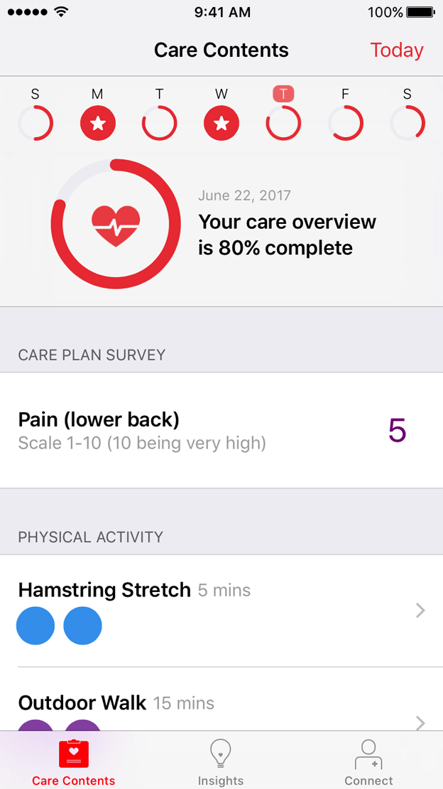
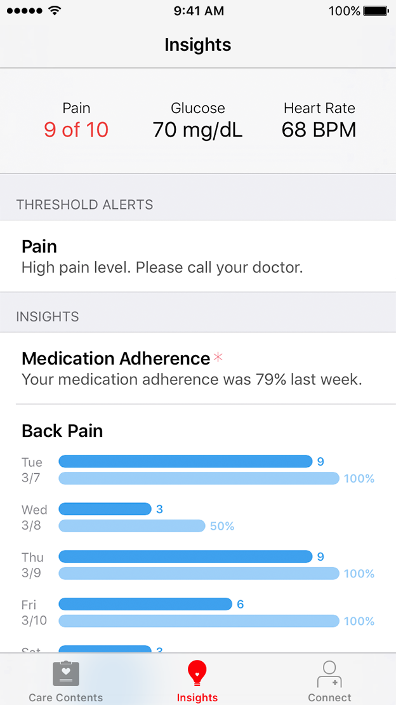
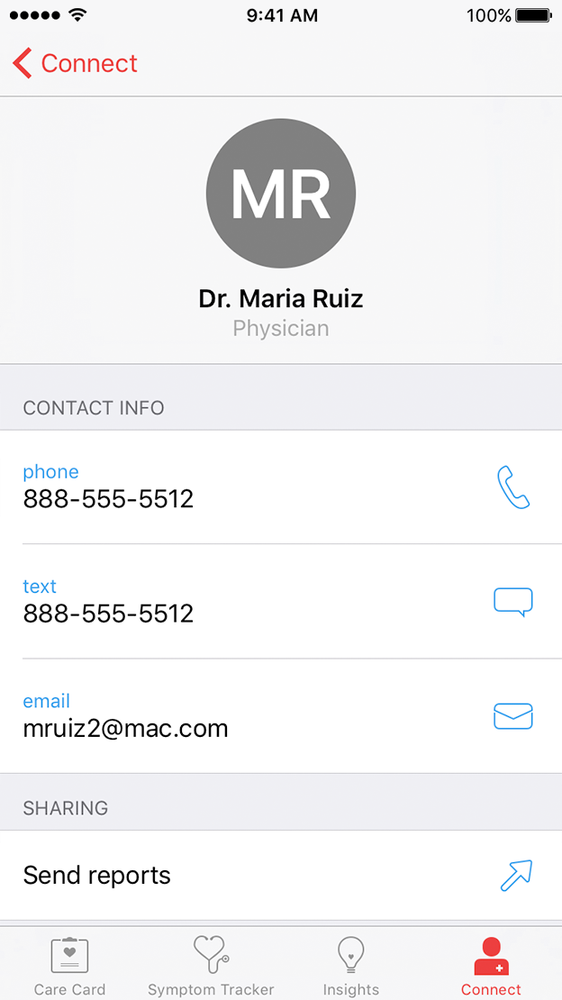

 
These materials are for informational purposes only and do not constitute legal advice. You should contact an attorney to obtain advice with respect to the development of a CareKit app and any applicable laws.

# CareKit Framework Programming Guide

CareKit is an open source framework for creating apps that place users at the center of their medical care. CareKit apps help users track treatment tasks, assess their progress, and communicate with caregivers, family, and friends. 

CareKit is appropriate for a wide range of care plans—from managing chronic illnesses, such as diabetes, to recovery from injury or surgery, to achieving health and wellness goals.

**On This Page:**
<ul>
<li> <a href="#organization">Framework Organization</a> </li>
<li><a href="#modules">CareKit Modules Overview</a> </li>
<li><a href="#bridgeAPI">Connecting App Data with the Bridge API</a> </li>
<li><a href="#IOS">Leveraging Existing iOS Technologies</a></li>
</ul> 

## Framework Organization

The CareKit framework is organized into user interface modules and data types in the care plan store and Contacts. The care plan store is a persistent database that holds the data describing the care plan, and the UI modules display and/or modify the data as shown in *Figure 1*.

 
<figcaption>Figure 1: Relationship of UI modules and data types in the CareKit framework.</figcaption>

### Summary of Modules:

**Care Contents.** The scene managed by an `OCKCareContentsViewController` view controller. Care Contents is a comprehensive scene that can display any and all activity types.

**Insights.** The scene managed by an `OCKInsightsViewController` view controller. The Insights scene displays charts and widgets that show the relationship between a user's treatment and their progress. The Insight scene can also include tips, alerts, and thresholds that help the user stay on track with their health goals. 

**Connect.** The scene managed by an `OCKConnectViewController` view controller. The Connect scene helps the user communicate their health status and Insights data with care team members, family, and friends.

**Care Card.** The scene managed by an `OCKCareCardViewController` view controller.  The Care Card presents and manages the tasks that the user is expected to perform as part of their treatment. For example, a task may be taking a medication, changing a wound dressing, or meditating.

**Symptom and Measurement Tracker.** The scene managed by an `OCKSymptomTrackerViewController` view controller. The Symptom and Measurement Tracker presents and manages tasks that evaluate the effectiveness of the user's care plan. These include the subjective assessment of symptoms (such as pain scales) and objective measurements (such as blood pressure).

**Care Plan Store.** The persistent database accessed through an `OCKCarePlanStore` object. The Care Plan Store locally stores the data displayed by the Care Card and Symptom and Measurement Tracker. CareKit automatically loads the store’s data as soon as the store is created, and automatically saves changes you make to the store. 

**Documents.** An `OCKDocument` object. This class creates custom reports that incorporate graphs and other information from the Insights module. Use `OCKDocument` to create PDF or HTML files that users can share with their contacts. A document can include a title, subtitles, text, images, and charts.

### Key Data Types:

**Intervention Activity.** An `OCKCarePlanActivity` object with an `OCKCarePlanActivityTypeIntervention` type. Intervention activities represent the user’s care plan. They are stored in the Care Plan Store and displayed in the Care Card or in Care Contents.

**Assessment Activity.** An `OCKCarePlanActivity` object with an `OCKCarePlanActivityTypeAssessment` type. Assessment activities represent the plan for monitoring and evaluating the treatment's effectiveness. They are stored in the Care Plan Store and are displayed in the Symptom and Measurement Tracker or in the Care Contents.

**Read-Only Activity** An `OCKCarePlanActivity` object with an `OCKCarePlanActivityTypeReadOnly` type. A read-only activity displays information and requires no action from the user. For example, it can provide day-of-surgery dietary instructions, or tricks and tips that might be interesting to share throughout a user's care journey.

**Intervention Event.** An `OCKCarePlanEvent` object associated with an intervention activity. These events represent the individual tasks that the user is expected to perform as part of their care plan. CareKit generates intervention events from active intervention activities. For example, if the activity indicates taking three doses of medication per day, CareKit generates three events for each day. 

**Assessment Event.** An `OCKCarePlanEvent` object associated with an assessment activity. These events represent the individual tasks that the user is expected to perform to monitor and evaluate the progress of their treatment. CareKit generates assessment events from active assessment activities. For example, if the activity indicates one pain survey per day, CareKit generates one event for each day. 

**Contact.** An `OCKContact` object. These contacts represent the user’s caregivers and supporters. CareKit displays contacts in the Connect module.

**Chart.** A concrete `OCKChart` subclass. Charts create a visual representation of the provided data. Charts can be both displayed in the Insights module and added to an `OCKDocument` object.

** Widget.**  An `OCKPatientWidget` object. A widget is a key metric that is prominently displayed at the top of the Insights scene. A single widget consists of a title, short text, and color. The widget view controller displays up to three widgets. 

**Threshold.** An `OCKCarePlanThreshold` object. A threshold is a value that is set on assessment or intervention activities that, when reached, can display an alert on the Insights scene or be used to perform custom logic.

## CareKit Modules Overview 

### Care Contents

<figcaption>Figure 2: The Care Contents view.</figcaption>

The Care Contents view controller is a comprehensive view that can display all CareKit activities. On the Care Contents scene, users can see:

* progress for the day with ring view and customizable glyph
* all intervention activities
* all assessment activities 
* all optional activities
* read-only information

If you prefer to break out the interventions and assessments onto multiple screens, you can use the Care Card and Symptom Tracker view controllers instead of the Care Contents; however, only the Care Contents view supports read-only and optional activities.

Ideally, users fill out the tasks on the Care Contents scene as they perform them; however, they can also go back and edit previous days' events. Users navigate to different days by tapping and swiping the days of the week along the top of the screen. They cannot view or edit days in the future.

The ring view with the customizable glyph at the top of the screen shows the percentage of required activities the user has completed. Once the user completes all required activities, the ring fills in and a star appears.

### Insights

<figcaption>Figure 3: The Insights view.</figcaption>

The Insights view presents widgets, threshold alerts, messages, and charts that shed light on the user's progress towards their treatment goals. While you can provide your own charts, CareKit includes support for bar charts. 

You can use bar charts to show side-by-side comparisons of any data. A typical use may show the correlation between the user's adherence to their intervention activities and the results of their assessment activities. For example, you could create a bar chart that compares the number of times the user took their pain medication with the results from their daily pain survey. Hopefully, as compliance goes up, the chart would show the subjective measure of pain going down.

For more information, see [Presenting Care Plan Data](../PresentingInsights/PresentingInsights-template.md)

### Connect

<figcaption>Figure 4: The Connect view.</figcaption>

The Connect view displays key members of the user's care team, and members of the user's support network, such as relatives or close friends. You can choose to include the messaging feature, which provides the user interface for direct messaging. The Inbox section appears on the Connect view any time a message is present.

Users select a contact to see the contact's details. 

<figcaption>Figure 5: The contact details view.</figcaption>

The contact detail scene lets the user communicate with the contact by phone, text, or email. The scene provides a button for each supported communication method. When the user selects a communication method, CareKit displays a pre-populated interface for the selected communication.

The contact card provides a send reports button that lets users share a PDF report with their Connect contact.

As with activities, you can create the contacts programmatically, or load them from a saved file; however, contacts are not saved in the Care Plan Store. Instead, they are managed directly by the connect view controller. Replacing the connection view controller's `contacts` property updates the Connect scene.

For more information, see [Connecting with Care Teams and Emergency Contacts](../ConnectingWithCareTeamsAndPersonalContacts/ConnectingWithCareTeamsAndPersonalContacts-template.md)

### Care Card

<figcaption>Figure 6: The Care Card view.</figcaption>

The Care Card and Symptom Tracker scenes are an alternative to using the comprehensive Care Contents view. All the features of a Care Card are available on the Care Contents view.

The Care Card shows the user’s care plan for a particular day. The Care Card tracks the user's progress as they mark off intervention events. The ring view with a customizable glyph at the top of the screen shows the percentage of required activities the user has completed. Once the user completes all required interventions for the day, the ring fills in and a star appears.

Individual intervention activities are listed below the glyph, with a circle representing a single task the user must complete on the given day. For example, if a user's activity is to take medication three times per day, three circles appear. CareKit updates the corresponding event in the Care Plan Store when the user taps the circle to indicate task completion.

The schedule for intervention activities is very flexible. You can schedule an activity for any or all days of the week, or multiple times per day. For example, an exercise regime may be performed every other day, a medication taken every day, and a second medication taken three times per day. You have complete control over the activity's schedule.

The user views an activity's details by selecting the activity. The activity details scene can contain text, images, video, and sound. For example, for an activity that involves changing a bandage, the details scene could contain a video that shows how to remove bandage, clean the wound, and apply a new bandage.  

Users can navigate to different days by tapping and swiping the days of the week along the top of the screen. They cannot view or edit days in the future. 

For more information, see [Creating the Care Card](../CreatingTheCareCard/CreatingTheCareCard-template.md).

### Symptom and Measurement Tracker

<figcaption>Figure 7: The Symptom and Measurement Tracker scene.</figcaption>

The Care Card and Symptom Tracker scenes are an alternative to using the comprehensive Care Contents view. All the features of a Symptom and Measurement Tracker are also available on the Care Contents view.

The Symptom and Measurement Tracker module displays assessment activities that measure the care plan’s effectiveness. 

Assessments can be either subjective or objective measurements:

* *Subjective* assessments ask the user to evaluate aspects affected by the care plan. Common subjective assessments include pain surveys, mood surveys, and quality of life surveys. 
* *Objective* assessments rely on data generated by hardware devices. Often this data can be passively collected, such as heart rate samples from Apple Watch or daily step counts from the iPhone motion sensor.  However, assessment activities may ask the user to actively collect data using a hardware device, such as a  wireless sphygmomanometer or a wireless scale.

The ring view with the customizable glyph at the top of the screen shows the percentage of required assessments the user has completed. Once the user completes all required activities for the day, the ring fills in, a checkmark appears, so users can easily distinguish 100% compliance.

Assessment activities can be scheduled for any or all days of the week, and/or for multiple times per day. For example, some surveys may be scheduled on a daily basis while others are weekly, while a blood pressure measurement may be scheduled for three times per day. You have complete control over the assessment's schedule.

Users start an assessment event by selecting the desired item from the list. CareKit then displays the selected assessment activity's scene. This scene comes from a custom view controller that you provide. As soon as the user has completed the task, CareKit updates the user's progress. 

**Note:** You may be able to simplify the design of your app by using a survey or active task from [ResearchKit](http://www.researchkit.org), instead of building a scene from scratch. 

Ideally, users complete assignment events during their assigned day; however, you can optionally let users edit previous days. Users navigate to different days by tapping and swiping the days of the week along the top of the screen. They cannot view or edit days in the future.

For more information, see [Creating the Symptom & Measurement Tracker](../CreatingTheSymptomAndMeasurementTracker/CreatingTheSymptomAndMeasurementTracker-template.md). 

### Care Plan Store

The Care Plan Store is a persistent database that manages the care plan's data. It automatically saves all treatment and assessment activities added to the care plan. It also records the user's progress as they complete treatment or assessment events.

Use the Care Plan Store to create or modify the care plan, or to access data about the plan. When building a care plan, your app can create the activities programmatically, or load them from a saved file. For example, you could download an electronic medical record and parse the data to produce a set of activities. Or you could present the user with a ResearchKit survey and use the results to create the activities. Alternatively, you could download prepackaged sets of activities from your server, or load them directly from your app's resource bundle.

You can change the care plan dynamically at runtime. CareKit automatically updates both the Care Card and the Symptom and Measurement Tracker in response to any changes to the care plan. You can monitor the Care Plan Store, to allow your app to perform additional updates as needed.

For more information, see [Accessing Care Plan Data](../AccessingCarePlanData/AccessingCarePlanData-template.md)

##Connecting App Data with the Bridge API

CareKit provides the bridge API to enable data sharing between a CareKit app's device storage and backend cloud storage solutions. The bridge API is an abstract cloud API that conforms to the Care Plan Store schema and enables data syncing without requiring additional configuration.

You can use CareKit's bridge API to create your own hooks to HIPAA-compliant backend storage. The API provides delegate functions that enable cloud bridges to work seamlessly with the CareKit framework.  These delegate functions provide the data synching mechanism by triggering for every type of state change in the database.

The bridge API is supported by third-party cloud storage providers, who provide CareKit-compatible solutions. You may be able to find a cloud solution without creating your own.

## Leveraging Existing iOS Technologies

CareKit is designed to leverage existing iOS technologies and design patterns. While the CareKit framework streamlines the process of creating high-quality care and treatment apps, having a basic understanding of iOS app design is important to understand how to best use the CareKit framework, and how to go beyond the functionality that the framework provides.

### Incorporating ResearchKit into CareKit Apps

ResearchKit and CareKit are closely related frameworks. Both frameworks focus on simplifying the app creation process without duplicating each other's features. You can incorporate ResearchKit features directly in your CareKit app. For example, you can use ResearchKit surveys and active tasks to create the user interface for CareKit's assessment tasks. Or, you can use ResearchKit charts within a CareKit dashboard.

For more information, see [ResearchKit Framework Programming Guide](http://researchkit.org/docs/docs/Overview/GuideOverview.html).

### Understanding Basic iOS App Design

iOS apps are designed as a series of scenes, with segues between scenes and containers to manage multiple scenes. Each scene is in turn managed by its own view controller. Learning how to create and combine scenes is vital for building all but the most basic iOS apps. 

If you are new to creating iOS apps, consider working through the [Start Developing iOS Apps (Swift)](https://developer.apple.com/library/ios/referencelibrary/GettingStarted/DevelopiOSAppsSwift/index.html#//apple_ref/doc/uid/TP40015214) tutorial.

For more information on views and view controllers, see [View Controller Programming Guide for iOS](https://developer.apple.com/library/ios/featuredarticles/ViewControllerPGforiPhoneOS/index.html#//apple_ref/doc/uid/TP40007457).

For design guidance, see [Human Interface Guidelines for iOS apps](https://developer.apple.com/carekit/human-interface-guidelines/).

### Using iOS Frameworks

The iOS SDK includes a large number of frameworks, providing a wide range of features and capabilities that you can incorporate into your app. The following examples highlight a few features that can greatly enhance a CareKit app.

#### Accessing HealthKit Data

The Health app is a central repository for health and fitness data in iOS. With your user's permission, your CareKit app can communicate with the Health app to access and share health and fitness information. You can incorporate the data into your app's assessments or into the reports that users can send to their caregivers.

In addition to retrieving information from the Health app, with the user's permission, your app can leverage the Health app to share potentially useful data with other apps.

For developer guidance, see [HealthKit](https://developer.apple.com/healthkit/).  

#### Incorporating Apple Watch

While a custom watchOS app can play a vital role in supporting your CareKit app, you can take advantage of Apple Watch even without building your own Watch app. Apple Watch can greatly assist a CareKit app in the following ways:

* Notifications are automatically forwarded from an iPhone to a paired watch. Users are more likely to notice and respond to a CareKit app's notifications in a timely manner with Watch.
* Apple Watch records useful information including activity summaries, step counts, and heart rate samples. This data is synced to the paired iPhone, where you can access it through HealthKit.

For more information, see [App Programming Guide for watchOS](https://developer.apple.com/library/watchos/documentation/General/Conceptual/WatchKitProgrammingGuide/index.html#//apple_ref/doc/uid/TP40014969). 

#### Sending Notifications

The iOS SDK lets your app schedule notifications, which are messages that appear onscreen and alert the user to useful information about your app. You can use notifications to remind users to complete their treatment and assessment tasks, or to alert users of potential problems. For example, if the user is supposed to be resting and recovering from surgery, you might want to notify them when the app detects a large number of steps or an unusually high heart rate.

For more information, see [Local and Remote Notification Programming Guide](https://developer.apple.com/library/ios/documentation/NetworkingInternet/Conceptual/RemoteNotificationsPG/Chapters/Introduction.html#//apple_ref/doc/uid/TP40008194).

#### Accessing Motion Data

The Core Motion framework lets you access data from an iOS device's motion coprocessor. The framework lets you determine whether the user is stationary, walking, running, cycling, or driving. When walking or running, it can also track step counts, pace, and the number of flights of stairs ascended or descended.

For more information, see [Core Motion Framework Reference](https://developer.apple.com/library/ios/documentation/CoreMotion/Reference/CoreMotion_Reference/index.html#//apple_ref/doc/uid/TP40009686).

#### Working with Asynchronous APIs

CareKit uses asynchronous methods to read and write data to the Care Plan Store. Instead of pausing the app while the framework reads or writes its data, CareKit places the work on a background thread and returns immediately. After the work is finished, it calls your completion handler (on an anonymous background thread) with the result.

Such background execution prevents your app from feeling sluggish or unresponsive. However, coordinating multiple threads can be considerably more complex than managing a single threaded application. Fortunately, iOS provides a number of options to help tame these background threads.

For more information, see [Concurrency Programming Guide](https://developer.apple.com/library/ios/documentation/General/Conceptual/ConcurrencyProgrammingGuide/Introduction/Introduction.html#//apple_ref/doc/uid/TP40008091).

#### Networking

If you plan to download information from an electronic medical record system or from your server, you need to understand basic iOS networking. For information on modern networking technologies in iOS, see the [Networking with NSURLSession](https://developer.apple.com/videos/play/wwdc2015/711/) video or [URL Session Programming Guide](https://developer.apple.com/library/ios/documentation/Cocoa/Conceptual/URLLoadingSystem/URLLoadingSystem.html#//apple_ref/doc/uid/10000165i).

## Privacy and CareKit

Nothing is more important than protecting the user's privacy with regard to the extremely personal information your CareKit app collects and stores. It is incumbent upon you to provide a clearly stated privacy policy to users of your app. There is an opportunity to do this within the iTunes Connect Privacy Policy URL. For developer guidance, see [App information - iTunes Connect Developer Help.](https://help.apple.com/itunes-connect/developer/#/dev219b53a88)
