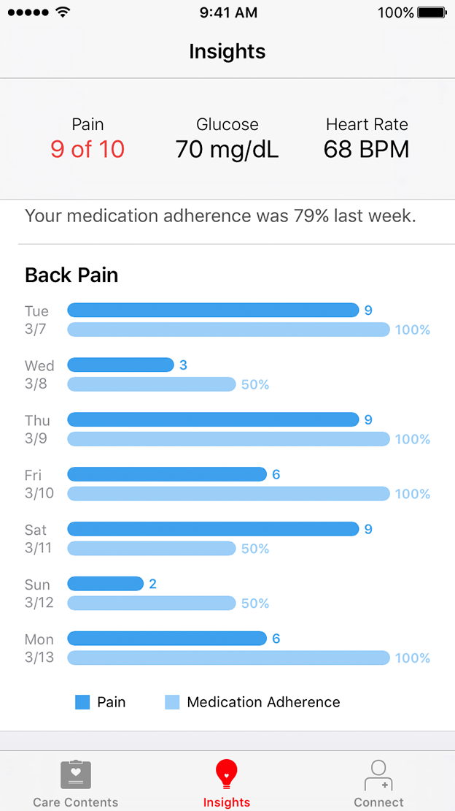

<br/>
<sub>These materials are for informational purposes only and do not constitute legal advice. You should contact an attorney to obtain advice with respect to the development of a CareKit app and any applicable laws.</sub>

# Presenting Insights

The Insights scene lets you easily and quickly present charts and messages to the user (see Figure 1). Often, an Insights scene is used to visualize the correlation between a treatment plan's intervention activities and its assessment activities; however, it is not limited to just presenting CareKit data. You can use the scene's charts and messages to display any arbitrary data.

<center>
<figcaption>Figure 1: The Insights scene from the OCKSample app.</figcaption></center>

The Insights scene displays one or more `OCKInsightItem` subclasses. CareKit provides two concrete subclasses that you can use in your apps: `OCKMessageItem` and `OCKBarChart`.


## Creating Messages

You can display simple text messages using the `OCKMessageItem` class. This class lets you specify the message's title, its body text, the type of message (alert or tip), and the color.

**Note:**  The message type and color affect only the symbol appended to the end of the message's title.

The following sample code creates the message shown in Figure 1.

```swift
// Calculate the percentage of completed events.
let medicationAdherence = Float(completedEventCount) / Float(totalEventCount)

// Create an `OCKMessageItem` describing medical adherence.
let percentageFormatter = NSNumberFormatter()
percentageFormatter.numberStyle = .PercentStyle
let formattedAdherence = percentageFormatter.stringFromNumber(medicationAdherence)!

let message = OCKMessageItem(
    title: "Medication Adherence",
    text: "Your medication adherence was \(formattedAdherence) last week.",
    tintColor: Colors.Pink.color,
    messageType: .Tip)
```

## Creating Charts

CareKit's bar charts let you display one or more series of values. To create a chart, perform the following steps:

1. Gather the data you wish to display.
2. Generate the labels for your data.
3. Scale or format your data as appropriate.
4. Create one or more bar chart series.
5. Create the bar chart itself.

Bar charts can be displayed in an Insights scene, or added to a CareKit document.

### Gathering Your Data

Often, the most difficult task is simply gathering the data you wish to display. If you are using data from your Care Plan Store, this means making one or more asynchronous calls, and then combining the data from all of the completion handlers.

For more information on reading data from the Care Plan Store, see [Accessing Care Plan Data](../AccessingCarePlanData/AccessingCarePlanData.html).

### Generating Your Labels

You need to create a number of labels for your charts. The chart may have a title, text, axis labels, and axis sublabels; however, all of these labels are optional.

The title and text appear in the upper left corner, above the chart. In Figure 1, the title is "Back Pain," and the chart does not have a text label.

The axis labels and sublabels appear along the left edge of the chart. In Figure 1, the axis labels are the letters indicating the day of the week. This chart does not have any axis sublabels.

Each series must also have a title. Figure 1 has two series. The first has the title "Pain." The second has the title "Medical Adherence."

Each data point in the series must also have a value label, which appears at the right edge of the respective bar. In Figure 1, for the pain series, the label is the pain value entered by the user in an assessment activity. For the medical adherence series, the label is the percentage of the medicine intervention activities completed for that day.


### Scale and Format the Data

A chart consists of a number of series, each of which contains an array of values. The chart attempts to graph these values in a meaningful way.

The minimum value for the chart is 0.0 or the lowest value from all the series in the chart, whichever is lowest. The maximum value is also 0.0 or the highest value from all the series in the chart, whichever is highest. The chart creates bars for each entry based on this range.


Because the chart's scale and origin are based on the data across all your series, you often need to scale or offset your data, so that all of your series use the same range. For example, if your medical adherence values range from 0.0 to 1.0, but your pain values range from 0.0 to 10.0, you need to either multiply your medical adherence values by 10.0, or divide your pain values by 10.0. Either approach works, because they both produce the same relative range of values.

### Creating Your Series

You need to instantiate one or more `OCKBarSeries` objects for your chart. Each distinct piece of data should have its own series. The following sample code demonstrates creating the series for the chart in Figure 1.

```swift
// Create a `OCKBarSeries` for each set of data.
let painBarSeries = OCKBarSeries(
    title: "Pain",
    values: painValues,
    valueLabels: painLabels,
    tintColor: Colors.Blue.color)

let medicationBarSeries = OCKBarSeries(
    title: "Medication Adherence",
    values: medicationValues,
    valueLabels: medicationLabels,
    tintColor: Colors.LightBlue.color)
```

### Creating Your Chart

Once you have your series, you can create the chart. The following sample code demonstrates creating the chart from Figure 1.

```swift
// Add the series to a chart.
let chart = OCKBarChart(
    title: "Back Pain",
    text: nil,
    tintColor: Colors.Blue.color,
    axisTitles: axisTitles,
    axisSubtitles: nil,
    dataSeries: [painBarSeries, medicationBarSeries])
```

## Creating the Insights Scene

To create your Insights scene, instantiate and present an `OCKInsightsViewController` view controller. The Insights view controller's `init` method takes an array of insight items (charts or messages), a title, and a subtitle. The title and subtitle are both optional.

The following sample code creates an Insights view controller like the one shown in Figure 1.

```swift
let insightsViewController = OCKInsightsViewController(
    insightItems: [message, chart],
    headerTitle: "Weekly Charts",
    headerSubtitle: nil)
```

### Updating Your Chart

CareKit's messages and charts are immutable objects, which means that you cannot change them after they are created. However, you can update your Insights scene by assigning a new array of insight items to the Insights view controller's `items` property, as shown below:

```swift
insightsViewController.items = [message, chart]
```

CareKit automatically populates the scene with the new charts and messages.

### Putting It All Together

The following sample code shows a complete run through of all the steps needed to update an Insights View Controller, using the data gathered from the sample code in [Accessing Care Plan Data](../AccessingCarePlanData/AccessingCarePlanData.html).


```swift
// Wait until all the data is gathered, then process the results.
dispatch_group_notify(gatherDataGroup, mainQueue) {

    // Generate the labels and data
    let dateStrings = completionData.map({(entry) -> String in

        guard let date = calendar.dateFromComponents(entry.dateComponent) else {
            fatalError("Unable to create date")
        }

        return NSDateFormatter.localizedStringFromDate(date, dateStyle: .ShortStyle, timeStyle: .NoStyle)
    })

    let completionValues = completionData.map({ (entry) -> Double in
        return entry.value
    })

    let completionValueLabels = completionValues.map({ (value) -> String in
        return NSNumberFormatter.localizedStringFromNumber(value, numberStyle: .PercentStyle)
    })

    let rawStressValues = completionData.map({ (entry) -> Double? in
        return stressAssessmentData[entry.dateComponent]
    })

    let stressValues = rawStressValues.map({ (valueOrNil) -> Double in
        guard let value = valueOrNil else {
            return 0.0
        }

        // Scale to match the completion values
        return value / 10.0
    })

    let stressValueLabels = rawStressValues.map({ (valueOrNil) -> String in
        guard let value = valueOrNil else {
            return ""
        }

        return NSNumberFormatter.localizedStringFromNumber(value, numberStyle: .DecimalStyle)
    })

    // Create the series

    let completionSeries = OCKBarSeries(
        title: "Treatment Plan Completed",
        values: completionValues,
        valueLabels: completionValueLabels,
        tintColor: UIColor.blueColor())

    let stressAssessmentSeries = OCKBarSeries(
        title: "Stress Assessment",
        values: stressValues,
        valueLabels: stressValueLabels,
        tintColor: UIColor.redColor())

    // Create the chart

    let chart = OCKBarChart(
        title: "Treatment Plan",
        text: "Compliance and Stress",
        tintColor: UIColor.greenColor(),
        axisTitles: dateStrings,
        axisSubtitles: nil,
        dataSeries: [completionSeries, stressAssessmentSeries])

    // Create the message

    let averageCompliance = completionValues.reduce(0.0, combine: +) / Double(completionValues.count)

    let messageString = "Over the last week, you completed an average of \(NSNumberFormatter.localizedStringFromNumber(averageCompliance, numberStyle: .PercentStyle)) of your treatment plan per day."

    let message = OCKMessageItem(
        title: "Compliance Rate",
        text: messageString,
        tintColor: UIColor.blackColor(),
        messageType: .Alert)

    // Update the view controller.
    insightViewControler.items = [chart, message]
}
```

## Creating a Document


CareKit lets you create HTML and PDF reports that the user can export and send to their care team, family, or friends. Documents consist of a title, a page header, and one or more elements. CareKit provides support for the following element types:

* Subtitles
* Paragraphs
* Images
* Charts
* Tables

To create a document:

1. Create your document elements.
2. Create the document using these elements.
3. Access the document data:
    * Access an HTML version of the document through the document's `HTMLContent` property.
    * Create a PDF version of the document by calling the document's `createPDFDataWithCompletion:` method.

### Creating the Document Elements

The following sample code creates a subtitle element, a chart element, and a paragraph element.

```swift
let subheadElement = OCKDocumentElementSubtitle(subtitle: "Weekly Summary")

let chartElement = OCKDocumentElementChart(chart: chart)

let paragraphElement = OCKDocumentElementParagraph(content: "Lorem ipsum dolor sit amet, vim primis noster sententiae ne, et albucius apeirian accusata mea, vim at dicunt laoreet. Eu probo omnes inimicus ius, duo at veritus alienum. Nostrud facilisi id pro. Putant oporteat id eos. Admodum antiopam mel in, at per everti quaeque. Lorem ipsum dolor sit amet, vim primis noster sententiae ne, et albucius apeirian accusata mea, vim at dicunt laoreet. Eu probo omnes inimicus ius, duo at veritus alienum. Nostrud facilisi id pro. Putant oporteat id eos. Admodum antiopam mel in, at per everti quaeque. Lorem ipsum dolor sit amet, vim primis noster sententiae ne, et albucius apeirian accusata mea, vim at dicunt laoreet. Eu probo omnes inimicus ius, duo at veritus alienum. Nostrud facilisi id pro. Putant oporteat id eos. Admodum antiopam mel in, at per everti quaeque.")
```

**Note:** The `OCKDocumentElementChart` class lets you use CareKit charts in your documents, which means that you can use the same chart in both your reports and your Insights scene.

### Create the Document

With the document elements in hand, you can create the document and set its page headers, as shown below:

```swift
let document = OCKDocument(title: "Weekly Update", elements: [subheadElement, chartElement, paragraphElement])

document.pageHeader = "\(dateString) update for \(userName)"
```

### Accessing the Document Data

After you have created a valid document object, you can access the HTML or PDF data from the document. The code sample below demonstrates creating a PDF version of the document.

```swift
document.createPDFDataWithCompletion { (PDFData, errorOrNil) in
    if let error = errorOrNil {
        // perform proper error checking here...
        fatalError(error.localizedDescription)
    }

    // Do something with the PDF data here...
}
```

**Note:** The callback block's `PDFData` parameter contains an `NSData` object. For more information on working with NSData objects, see [NSData Class Reference](https://developer.apple.com/library/mac/documentation/Cocoa/Reference/Foundation/Classes/NSData_Class/).

### Document Privacy
After the document is generated, it is possible to print or share it; however, CareKit does not provide this functionality. User privacy should be considered when exposing such features in apps that use CareKit. For more information, please see the [Secure Coding Guide.](https://developer.apple.com/library/ios/documentation/Security/Conceptual/SecureCodingGuide/Introduction.html)
